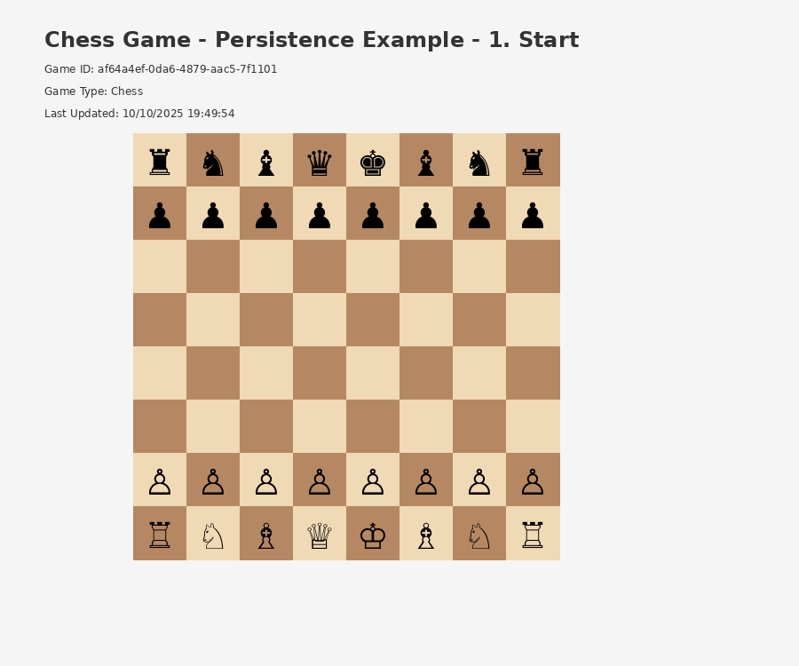
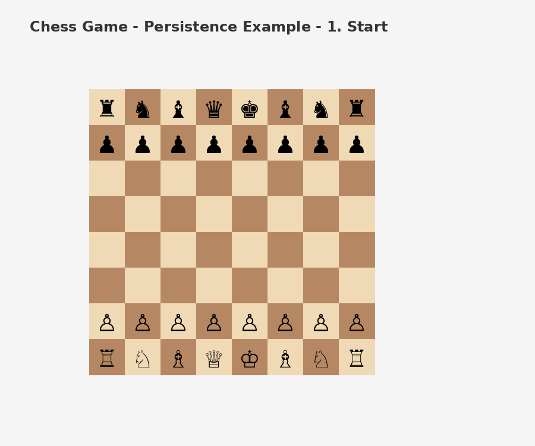

# Chess CompleteFlow Tests - Animated Demonstrations

This document displays the three GIF animations that prove all Chess CompleteFlow tests are working correctly.

---

## Test 1: Start → Move → Save → Move → Load

**Test**: `CompleteFlow_StartMoveSaveMoveLoad_RestoresPawnPosition`

**Purpose**: Verifies that loading a saved game restores the exact board state at save time, discarding any moves made after saving.

**Flow**:
1. **Start** - Create new chess game with initial board
2. **Move** - White pawn e2 → e4
3. **Save** - Save the game state
4. **Move** - Black pawn e7 → e5  
5. **Load** - Restore saved state (white at e4, black back at e7)

**Result**: ✅ Loading successfully discarded the move made after saving.

---

## Test 2: Start → Move → Save → New → Load

**Test**: `CompleteFlow_StartMoveSaveNewLoad_ShowsSinglePawnMoved`

**Purpose**: Verifies that after creating a new game (which resets the board), loading the saved game restores the previous game state.

**Flow**:
1. **Start** - Create new chess game with initial board
2. **Move** - White pawn e2 → e4
3. **Save** - Save the game state
4. **New** - Click "New Game" to reset board
5. **Load** - Restore saved state (white at e4)

**Result**: ✅ Loading successfully restored the saved state after board reset.

---

## Test 3: Start → Move → Move → Eat → Save → New → Load

**Test**: `CompleteFlow_StartMoveMoveEatSaveNewLoad_ShowsPawnMovedTwiceAndEaten`

**Purpose**: Verifies that save/load correctly preserves complex game states including piece captures.

**Flow**:
1. **Start** - Create new chess game with initial board
2. **Move** - White pawn e2 → e4
3. **Move** - Black pawn e7 → e5
4. **Eat** - White pawn captures black d7 pawn, moves to d6
5. **Save** - Save the game state
6. **New** - Click "New Game" to reset board
7. **Load** - Restore saved state (white at d6, black d7 captured, black e7 at e5)

**Result**: ✅ Loading successfully restored complex game state with captures.

---

## Summary

All three Chess CompleteFlow tests are now working correctly:

✅ **Test 1**: Verifies load discards post-save moves  
✅ **Test 2**: Verifies load works after board reset  
✅ **Test 3**: Verifies load preserves complex states with captures

The GIF animations provide visual proof that the save/load persistence functionality is working as intended.

---

## Technical Notes

- **GIF Format**: GIF89a, 900x750 pixels
- **Frame Duration**: 1500ms per frame
- **Total Size**: ~352KB (all 3 GIFs)
- **Generation**: Automated via Python/PIL during test execution
- **Content**: Full chess board with Unicode pieces, game state, and step labels

For more details, see:
- `CHESS_TESTS_SUMMARY.md` - Comprehensive test documentation
- `CHESS_GIFS.md` - GIF technical details
- `tests/Examples.Tests.UI/test-results/README.md` - Test flow specifications
